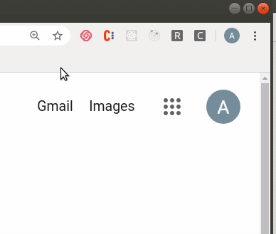

# Covtension

A simple chrome extension built in HTML, CSS and JS that allows users search for live coronavirus data on any country.

## Video demo



## Getting Started

**To get started, follow the instructions below**

To get a local copy up and running follow these simple steps.

- git clone the repo

```
git clone https://github.com/onedebos/covtension && cd covtension
```

- Install all the required packages with

```
npm install
```

- Build from webpack

```
npm run build
```

To install in Chrome

- Head over to chrome://extensions
- Toggle "Developer mode" on.
- Click Load unpacked.
- Upload the dist folder to chrome
- The extension should now be available for use

### Automated Tests

- Currently, there are no automated tests avaailable for this project. This will be implemented at a later date.

## Authors

👤 **Adebola**

- Github: [@githubhandle](https://github.com/onedebos)
- Twitter: [@twitterhandle](https://twitter.com/debosthefirst)
- Linkedin: [linkedin](https://www.linkedin.com/in/adebola-niran/)
